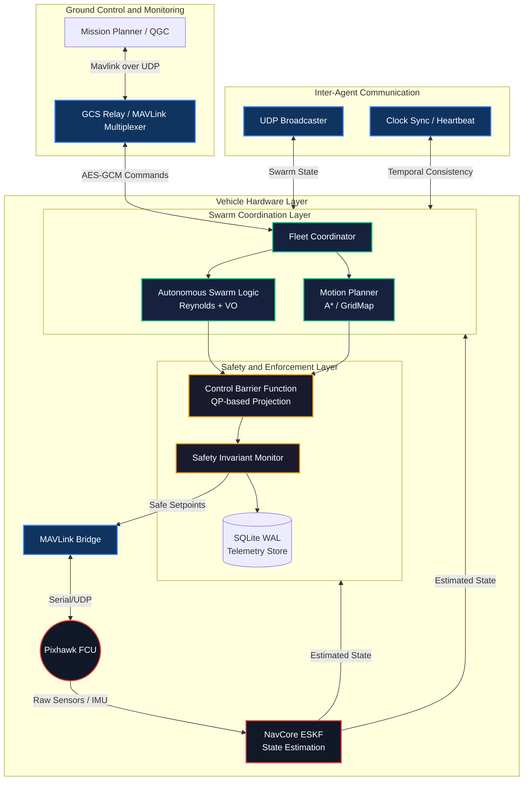

# Swayam — MAVLink Swarm Communication & Fleet Management

[](https://github.com/ARYA-mgc/Swayam_Fleet/actions/workflows/test.yml)
[](https://github.com/ARYA-mgc/NavCore-Pixhawk)
[](https://opensource.org/licenses/MIT)

Swarm Communication System for INS-guided, GPS-independent multi-drone coordination. Developed as part of the **NavCore-Pixhawk** ecosystem by [ARYA-mgc](https://github.com/ARYA-mgc).


*Multi-rotor drones performing coordinated formation flight — real-world swarm deployment.*

---

## Ecosystem

Swayam is a module within the NavCore-Pixhawk ecosystem — a collection of repositories for building autonomous, GPS-denied drone systems:

| Repository | Role |
| :--- | :--- |
| **[NavCore-Pixhawk](https://github.com/ARYA-mgc/NavCore-Pixhawk)** | Core INS navigation, sensor fusion & flight control |
| **Swayam_Fleet** (this repo) | Multi-drone swarm coordination, fleet management & GCS relay |

All modules share a common MAVLink transport layer and are designed to operate together on Pixhawk Cube Orange + Raspberry Pi 4 hardware.

---

## Features

| Feature | Description |
| :--- | :--- |
| **INS Navigation** | Dead-reckoning via IMU integration — body-to-world frame rotation, gravity compensation, velocity & position tracking. No GPS required. |
| **A* Path Planning** | 8-directional A* on a 50×50 m occupancy grid with Euclidean heuristic and obstacle inflation. |
| **MAVLink Integration** | SET_POSITION_TARGET_LOCAL_NED setpoints, ARM/DISARM, mode switching, SCALED_IMU2 telemetry. |
| **Fleet Coordination** | N drones in parallel threads. Broadcast missions or individual assignments. Emergency land all. |
| **Aerospace Control** | Cascaded PID position loops, explicit jerk limits (20 m/s³), and back-calculation Anti-Windup. |
| **Safety Guarantees** | Control Barrier Functions (CBF) for provable 1.5m minimum separation. Runtime Safety Invariant monitor. |
| **Collision Avoidance** | Velocity Obstacle (VO) prediction with cross-product discriminant. Deterministic symmetry-breaking. |
| **Geofence** | Absolute Geofence dominance (Hard RTL on breach) prioritized over all mission logic. |
| **SQLite Database** | 3-table schema: flight_logs, ins_telemetry, missions. Asynchronous WAL mode. |
| **Mission Planner GCS** | Native integration with Mission Planner — acts as a MAVLink relay for swarm discovery. |
| **Encryption** | AES-GCM encrypted inter-drone communication with anti-replay protection. |

---

## System Architecture

The Swayam Fleet architecture is partitioned into logical operational layers, ensuring a separation of concerns between high-level coordination and low-level flight control.



### Directory Structure
```text
src/swayam/
├── core/
│   ├── core.py              # Fleet coordinator & DroneAgent logic
│   └── navcore/             # ESKF state estimation API
├── control/
│   ├── logic.py             # VO, flocking, PID, and geofence
│   ├── safety.py            # CBF, Lyapunov, and IEEE-754 guards
│   ├── mission.py           # Multi-drone waypoint handler
│   └── mp.py                # A* GridMap & path planning
├── comms/
│   ├── mav.py               # Robust Pi-to-Cube MAVLink bridge
│   ├── bridge.py            # INS-to-MAVLink telemetry mapper
│   ├── relay.py             # MAVLink multiplexer (GCS Relay)
│   ├── telem.py             # UDP swarm state broadcaster
│   ├── sec.py               # AES-GCM encryption & security
│   └── sync.py              # Multi-drone synchronization
├── hardware/
│   ├── node.py              # Main RPi4 entry point
│   ├── health.py            # RPi4 + Pixhawk monitoring
│   └── hw.py                # Hardware-specific configurations
└── tests/                   # 57+ pytest tests (Safety, Swarm, Stress)
```

---

## Core Implementation Details

### INS Navigation Detail
The `INSState` class implements a strapdown Inertial Navigation System:

| Step | Operation | Formula |
| :--- | :--- | :--- |
| 1 | Attitude Update | roll += ωx · dt, pitch += ωy · dt, yaw += ωz · dt |
| 2 | Body → World Rotation | Full ZYX Euler rotation matrix applied to accelerometer |
| 3 | Gravity Removal | Subtract g = 9.80665 m/s² from world-frame Z (NED down) |
| 4 | Velocity Integration | v += a_world · dt |
| 5 | Position Integration | p += v · dt |

### Safety Guarantees — safety.py
The system provides mathematically provable safety through three formal layers:

| Layer | Mechanism | Guarantee |
| :--- | :--- | :--- |
| **Control Barrier Function** | h(x) = \|\|p_i - p_j\|\|^2 - d_safe^2 | Minimum 1.5m pairwise separation via velocity projection |
| **Safety Invariant Monitor** | Runtime assertions | Logs all separation, velocity, and geofence violations |
| **Lyapunov Certificate** | V(e) = 0.5 * (w_p\|\|e_p\|\|^2 + w_v\|\|e_v\|\|^2) | Ensures PID controller energy is non-increasing |

**CBF Enforcement Flow:**
`Mission Velocity --> Flocking Blend --> Geofence Clamp --> CBF Projection --> PID --> Sanitize --> FCU`

---

## Visual Documentation

### Mission Planner GCS Interface

*Mission Planner managing a fleet of drones in GUIDED mode with real-time telemetry overlays.*

### Preflight Status & Diagnostics

*ArduPilot preflight panel showing hardware health and EKF status validation.*

### Fleet Distance Metrics

*Real-time distance tracking between Agent 1 and other swarm members to maintain safety buffers.*

### Waypoint Convergence Tracking

*Tracking distance from swarm centroid to targets; sawtooth patterns indicate rapid convergence.*

### Experimental Results: 3D Reconstruction

*High-fidelity 3D trajectory reconstruction showing global waypoint convergence for a 7-agent swarm.*

---

## Quick Start

1. **Clone & Install**:
   ```bash
   git clone https://github.com/ARYA-mgc/Swayam_Fleet.git
   pip install -r requirements.txt
   ```
2. **Run Simulation**:
   ```bash
   python src/scripts/sim.py
   ```
3. **Connect Mission Planner**: Select **UDP**, port **14550**. Drones ALPHA, BETA, and GAMMA will appear automatically.
4. **Run Tests**:
   ```bash
   pytest tests/ -v
   ```

---

## Roadmap
- [ ] 3D Velocity Obstacles (Altitude-aware avoidance)
- [ ] MAVLink-FTP integration for log retrieval
- [x] Decentralized ESKF (NavCore integration)
- [x] AES-GCM Encrypted Telemetry
- [x] CBF-based Safety Enforcement

---
MIT License | Developed by [ARYA-mgc](https://github.com/ARYA-mgc)
