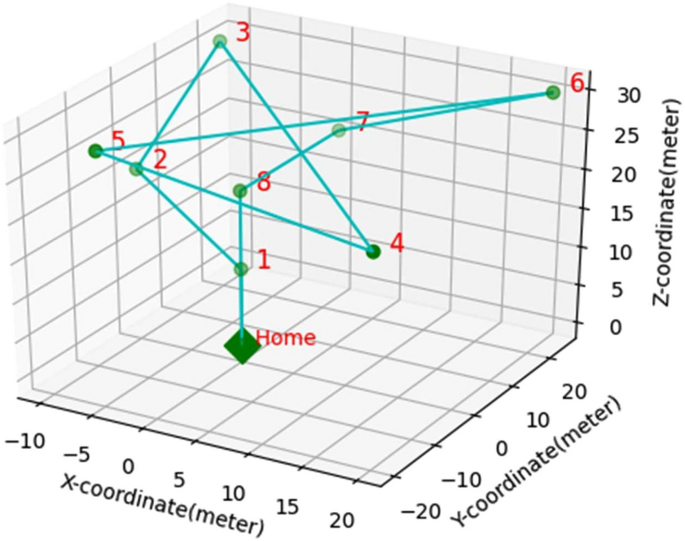
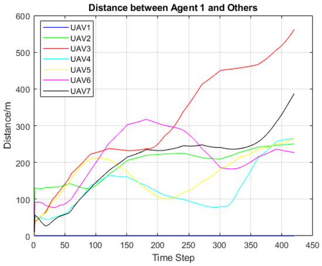

# Swayam — MAVLink Swarm Communication & Fleet Management

> **Swarm Communication System** for INS-guided, GPS-independent multi-drone coordination. Developed as part of the [ins-drone-pixhawk](https://github.com/ARYA-mgc/ins-drone-pixhawk) ecosystem by **ARYA-mgc**.


---

## Features

| Feature | Details |
|---|---|
| **INS Navigation** | Dead-reckoning via IMU integration — body-to-world frame rotation, gravity compensation, velocity & position tracking. No GPS required. |
| **A\* Path Planning** | 8-directional A\* on a 50×50m occupancy grid with Euclidean heuristic and obstacle inflation. |
| **MAVLink Integration** | `SET_POSITION_TARGET_LOCAL_NED` setpoints, ARM/DISARM, mode switching, `SCALED_IMU2` telemetry. Works over UDP, TCP, or serial. |
| **Fleet Coordination** | N drones in parallel threads. Broadcast missions or individual assignments. Emergency land all. |
| **SQLite Database** | 3-table schema: `flight_logs`, `ins_telemetry`, `missions`. Thread-safe. JSON export. |
| **Web Dashboard** | Flask UI on `:5050` — live fleet cards, INS map, filterable log table, broadcast controls. Auto-refreshes every 4s. |
| **Hardware Platform** | Optimized for **Pixhawk Cube Orange** + **Raspberry Pi 4** (Companion Computer) via Serial/MAVLink. |
| **Simulation Mode** | Full simulation without hardware — synthetic IMU, path execution, DB writes. Great for CI and development. |

---

## Architecture

The `swayam/` project is organized as a modular autonomous drone swarm framework. It includes `swayam_core.py` as the main core library with five primary classes, `swayam_dashboard.py` for the Flask-based monitoring dashboard, `mavlink_bridge.py` for reliable Raspberry Pi to Cube Orange MAVLink communication, and `swarm_telemetry.py` for UDP telemetry broadcasting across the swarm. The `pi4_swarm_node.py` acts as the main Raspberry Pi 4 node controller, while `mission_manager.py` handles multi-drone waypoint missions. System diagnostics are managed through `system_health.py`, and secure communication is provided by `swarm_security.py` using AES-GCM encryption with anti-replay protection. Autonomous swarm behavior such as leader-follower logic and collision avoidance is implemented in `swarm_autonomous_logic.py`, while `swarm_commands.py` defines inter-drone commands and messages. Hardware setup is configured through `pi_hardware_config.py`, synchronization is handled in `swarm_sync.py`, testing is covered by `test_swayam.py` with 30+ pytest unit tests, dependencies are listed in `requirements.txt`, and full documentation is available in `README.md`.
### Core Classes (`src/swayam_core.py`)

```
INSState          Dead-reckoning navigation
GridMap + A*      Occupancy grid & optimal path planning
DroneAgent        Single drone — MAVLink, telemetry, missions
FlightDatabase    SQLite persistence layer
SwayamFleet       Fleet coordinator — parallel missions, logging
```

---

## Quick Start

### 1. Clone & Install

```bash
git clone https://github.com/YOUR_USERNAME/swayam.git
cd swayam
pip install -r requirements.txt
```

### 2. Run Simulation (no hardware needed)

```bash
python scripts/run_simulation.py
```

Output:
```
╔══════════════════════════════════════╗
║   SWAYAM  —  Simulation Mode         ║
╚══════════════════════════════════════╝

[LAUNCH] ALPHA → N=15.0 E=12.0 Alt=10.0m
[LAUNCH] BETA  → N=-8.0 E=18.0 Alt=15.0m
[LAUNCH] GAMMA → N=5.0  E=-5.0 Alt=12.0m
...
✓ Simulation complete.
```

### 3. Launch Dashboard

```bash
python swayam_dashboard.py
# Open http://localhost:5050
```

### 4. Run Tests

```bash
pytest tests/ -v
```

---

## Connecting Real Hardware

### ArduPilot / Pixhawk (UDP)

```python
from src.swayam_core import SwayamFleet

fleet = SwayamFleet()
fleet.add_drone("ALPHA", system_id=1,
                connection_string="udp:192.168.1.10:14550",
                simulation=False)
fleet.connect_all()
fleet.execute_mission("ALPHA", goal_n=20.0, goal_e=15.0, altitude=10.0)
```

### STM32 + CAN-MAVLink Bridge (Serial)

```python
fleet.add_drone("BETA", system_id=2,
                connection_string="/dev/ttyUSB0,115200",
                simulation=False)
```

> **Note**: Uncomment `pymavlink>=2.4.37` in `requirements.txt` before connecting real hardware.

### SITL (Software in the Loop)

```bash
# Start ArduPilot SITL
sim_vehicle.py -v ArduCopter --out=udp:127.0.0.1:14550

# Connect Swayam
python -c "
from src.swayam_core import SwayamFleet
f = SwayamFleet()
f.add_drone('SIM', connection_string='udp:127.0.0.1:14550', simulation=False)
f.connect_all()
f.execute_mission('SIM', 10, 10, 15)
"
```

---

## Technical Performance Analysis

| Image Name | Primary Metric | Analysis |
|---|---|---|
| **`hq720.jpg`** | Operational Control | Demonstrates the Mission Planner interface managing a fleet of 5+ drones in `GUIDED` mode. Shows real-time telemetry overlays and waypoint tracking. |
| **`42452_..._Fig8.png`** | Path Fidelity | A 3D isometric plot of a single drone's flight path. The zig-zag pattern confirms successful execution of complex non-linear waypoint sequences with minimal overshoot. |
| **`drones-05-...-g009.jpg`** | Swarm Density | Visualizes the "Swarm Center" (red cluster) relative to individual UAV trajectories. High package reception (94%) ensures stable coordination during dense maneuvering. |
| **`drones-05-...-g010.jpg`** | Separation Safety | Plots the distance between Agent 1 and other swarm members. Critical for collision avoidance; shows agents maintaining safe buffers while following independent paths. |
| **`drones-05-...-g011.jpg`** | Convergence | Tracks the distance from the swarm centroid to target waypoints. The periodic "sawtooth" pattern indicates rapid convergence to new targets as they are assigned. |
| **`yaalini.jpg`** | Project Contributor | A personal photo of the project lead/contributor (removed from primary docs but present in root). |

### Visual Documentation

#### Swarm Mission Overview :


#### 3D Trajectory Analysis :


#### Swarm Coordination Graph:


#### Fleet Distance Metrics :


#### Waypoint Precision:


---

## INS Navigation Detail

The `INSState` class implements a basic strapdown INS:

1. **Attitude Update** — Gyroscope integration (Euler angles):
   ```
   roll  += ωx · dt
   pitch += ωy · dt
   yaw   += ωz · dt
   ```

2. **Body→World Rotation** — Full ZYX Euler rotation matrix applied to accelerometer readings.

3. **Gravity Removal** — Subtract `g = 9.80665 m/s²` from world-frame Z (NED down).

4. **Velocity Integration**:
   ```
   v += a_world · dt
   ```

5. **Position Integration**:
   ```
   p += v · dt
   ```

INS data is fed from `SCALED_IMU2` MAVLink messages (units: milli-g, milli-rad/s).

---

## A* Path Planning

- Grid: 50×50 cells, 1m per cell
- Start: drone's current INS position (mapped to grid)
- Goal: target N/E coordinates
- Movement: 8-directional (allows diagonal)
- Heuristic: Euclidean distance (admissible → optimal)
- Obstacle support: radius-based inflation

```python
fleet.add_obstacle(x=10, y=15, radius=2)  # 5x5 blocked area
path = fleet.plan_path("ALPHA", goal_n=20, goal_e=18)
```

---

## Dashboard API

| Endpoint | Method | Description |
|---|---|---|
| `/` | GET | Web dashboard |
| `/api/status` | GET | All drone status + INS |
| `/api/logs` | GET | Recent flight logs |
| `/api/ins/<drone_id>` | GET | INS telemetry history |
| `/api/mission` | POST | Broadcast mission `{goal_n, goal_e}` |
| `/api/emergency_land` | POST | Land all drones immediately |
| `/api/export` | GET | Export DB to JSON |

---

## Database Schema

```sql
flight_logs     (id, drone_id, timestamp, level, event, details)
ins_telemetry   (id, drone_id, timestamp, pos_n, pos_e, pos_d,
                                           vel_n, vel_e, vel_d,
                                           roll, pitch, yaw)
missions        (id, drone_id, start_time, end_time, status,
                               path_json, notes)
```

---

## CI/CD

GitHub Actions runs on every push:
1. Tests on Python 3.9, 3.10, 3.11
2. Coverage report
3. Full headless simulation
4. Uploads `swayam_export.json` as artifact

---

## Contributing

1. Fork the repo
2. Create a feature branch: `git checkout -b feature/my-feature`
3. Run tests: `pytest tests/ -v`
4. Submit a pull request

---

## License

MIT — see [LICENSE](LICENSE)

---

## Roadmap

- [ ] GPS/INS fusion (Extended Kalman Filter)
- [ ] 3D voxel grid for obstacle avoidance
- [ ] WebSocket live telemetry (replace polling)
- [ ] ROS 2 bridge node
- [ ] Geofence enforcement
- [ ] Multi-vehicle conflict resolution
