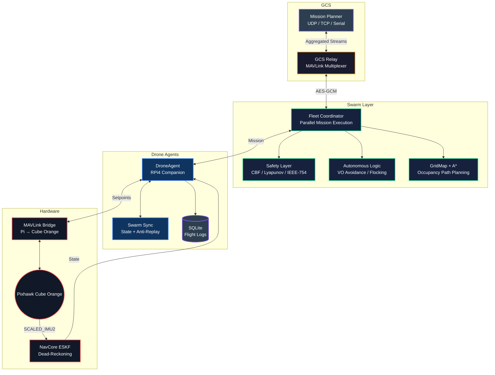

# Swayam Fleet (Or: How I learned to stop worrying and love UDP packet loss)

Code to make a bunch of Raspberry Pi 4s talk to Pixhawks so they don't crash into each other.
Built this because open-source options either need GPS (gross) or don't actually stop the drones from playing bumper cars in mid-air.


---

## What this mess actually does

- Runs a `DroneAgent` on each drone. Mostly it just yells MAVLink commands at the flight controller until it listens.
- `AutonomousSwarmLogic`: Reynolds flocking + Velocity Obstacles + some math I copied from a paper to make it look legit.
- "CBF projection" — basically just a fancy way of saying "don't get closer than 1.5m or the code will force you away".
- Geofence is absolute. If a drone tries to escape, it gets put in RTL timeout.
- State is shared over UDP telemetry. Yes, it drops packets. No, I haven't fixed it yet.
- SQLite database logs everything so when a drone inevitably crashes, I have proof it wasn't my fault.

Part of the [`ins-drone-pixhawk`](https://github.com/ARYA-mgc/ins-drone-pixhawk) ecosystem.

---

## Project structure

```
src/
  swayam/
    core/
      core.py          # fleet coordinator, drone agent, DB, A* grid map
      navcore/                # ESKF state publisher (shared with ins-drone-pixhawk)
    control/
      logic.py   # VO avoidance, flocking, PID, geofence
      safety.py        # CBF, Lyapunov certificate, IEEE-754 guards
      mission.py          # multi-drone waypoint missions
      mp.py
    comms/
      mav.py           # robust Pi-to-Cube MAVLink bridge
      bridge.py    # INS -> MAVLink message mapper
      relay.py          # MAVLink multiplexer for GCS
      telem.py          # UDP swarm state broadcaster
      sync.py               # multi-drone synchronization
      sec.py           # AES-GCM encrypted comms + anti-replay
      cmds.py           # inter-drone command definitions
    hardware/
      node.py           # main RPi4 entry point
      hw.py
      health.py
  scripts/
    sim.py
    stress.py
tests/                        # pytest suite (57 tests)
docs/assets/                  # screenshots, plots
.env.example
requirements.txt
```

---

## Quick start

```bash
git clone https://github.com/ARYA-mgc/Swayam_Fleet.git
cd Swayam_Fleet
pip install -r requirements.txt
cp .env.example .env
```

Run simulation (no hardware needed):

```bash
python src/scripts/sim.py
```

Connect Mission Planner:
1. UDP → Connect → port `14550`
2. Drones ALPHA, BETA, GAMMA show up automatically

Run tests:

```bash
pytest tests/ -v
```

---

## Real hardware

**ArduPilot / Pixhawk over UDP:**

```python
from src.swayam.core.core import SwayamFleet

fleet = SwayamFleet()
fleet.add_drone("ALPHA", system_id=1,
                connection_string="udp:192.168.1.10:14550",
                simulation=False)
await fleet.connect_all()
await fleet.execute_mission("ALPHA", goal_n=20.0, goal_e=15.0, altitude=10.0)
```

Uncomment `pymavlink==2.4.41` in `requirements.txt` before connecting real hardware.

**Serial (RPi4 → Cube Orange):**

```python
fleet.add_drone("BETA", system_id=2,
                connection_string="/dev/ttyAMA0,921600",
                simulation=False)
```

**SITL:**

```bash
sim_vehicle.py -v ArduCopter --out=udp:127.0.0.1:14550
python src/scripts/sim.py
```

---

## Architecture



**Control priority (strict):** `Geofence > Collision > Stability > Formation > Mission`

The CBF layer sits between the swarm logic output and the PID velocity controller. If the commanded velocity would cause two drones to come within 1.5m of each other, it gets projected onto the safe half-space before reaching the FCU.

---

## Safety layer

`safety.py` implements three things:

**ControlBarrierFunction** — projects velocity commands to maintain `h(x) = ||p_i - p_j||² - d_safe² >= 0` for all drone pairs. Uses iterative half-space projection (3 passes, converges for swarms up to ~10 drones).

**SafetyInvariant** — runtime monitor that checks separation, velocity bounds, and geofence at every control tick. Logs violations with timestamps.

**LyapunovCertificate** — verifies the PID controller energy is non-increasing across a flight. Not used in the control loop, useful for post-flight analysis.

---

## Known issues / gotchas

- **VO collision check is 2D only** — altitude separation isn't considered in the VO cone. The emergency envelope handles vertical avoidance separately with a deterministic up/down push based on drone ID hash.
- **Serial reconnect on timeout** — the MAVLink bridge doesn't auto-reconnect if the serial port disappears (RPi reboot). You have to restart the process. This is the next thing I want to fix.
- **Simulation battery drain** — simulated battery drains at 0.0001%/tick which is fine for short runs but will trigger RTL after a few hours of simulation.
- **CBF for >15 drones** — iterative half-space projection starts to degrade with large swarms. Would need to switch to a proper QP solver.

---

## GCS relay

For large swarms, use `SwarmGCSRelay` to aggregate all drone streams into one GCS connection:

```python
from src.swayam.comms.relay import SwarmGCSRelay

relay = SwarmGCSRelay("udpout:127.0.0.1:14550")
relay.add_drone(1, "udpin:127.0.0.1:14551")
relay.add_drone(2, "udpin:127.0.0.1:14552")
relay.start()
```

---

## Database schema

```sql
flight_logs     (id, drone_id, timestamp, level, event, details)
ins_telemetry   (id, drone_id, timestamp, pos_n, pos_e, pos_d,
                                           vel_n, vel_e, vel_d,
                                           roll, pitch, yaw)
missions        (id, drone_id, start_time, end_time, status,
                               path_json, notes)
```

WAL mode enabled. Writes go through an async queue with DROP_OLDEST backpressure so the DB never blocks the control loop.

---

## Roadmap

- [ ] Auto-reconnect on serial port loss
- [ ] 3D VO (altitude-aware collision prediction)
- [ ] WebSocket telemetry stream
- [ ] ROS 2 bridge node
- [x] GPS/INS fusion (ESKF)
- [x] Geofence enforcement
- [x] Multi-vehicle conflict resolution
- [x] CBF safety projection
- [x] Lyapunov verification

---

## License

MIT — see [LICENSE](LICENSE)
