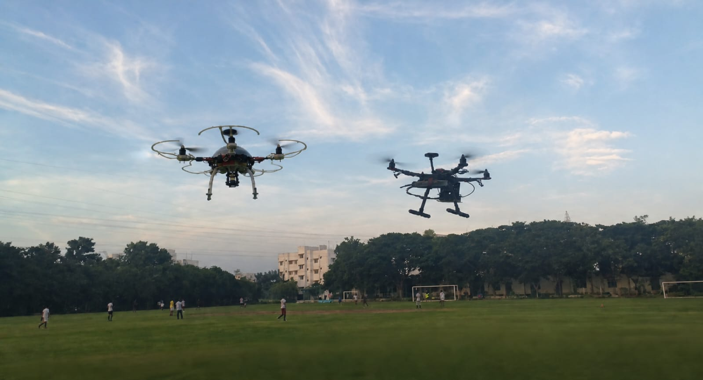
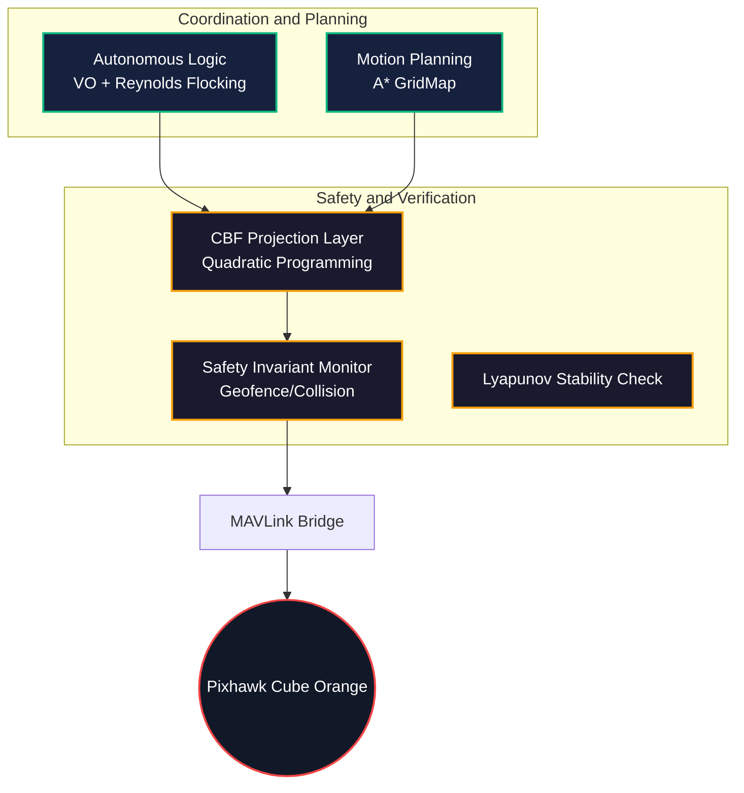
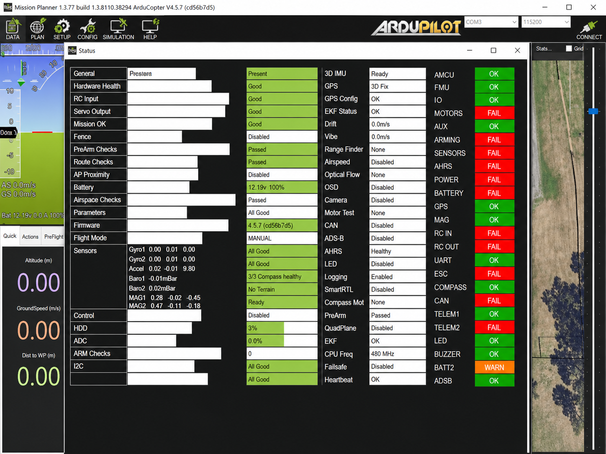
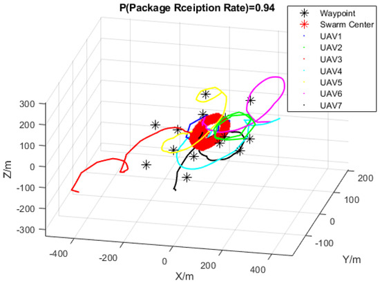

# Swayam Fleet: Decentralized Swarm Coordination and Safety Framework

[](https://github.com/ARYA-mgc/Swayam_Fleet/actions/workflows/test.yml)
[](https://github.com/ARYA-mgc/ins-drone-pixhawk)
[](https://opensource.org/licenses/MIT)

Swayam Fleet is a production-grade decentralized coordination and safety framework for multi-UAV swarms. Designed for Raspberry Pi 4 companion computers, it interfaces with ArduPilot/Pixhawk flight controllers to provide autonomous flocking, conflict resolution, and deterministic safety guarantees in GPS-denied or degraded environments.


*Field Validation: Dual-UAV formation flight utilizing decentralized velocity obstacles.*

---

## Technical Overview

Swayam Fleet addresses the critical challenges of multi-drone operations by implementing a decentralized architecture where each agent independently computes its navigation and safety constraints. This eliminates single points of failure and allows for scalable swarm sizes.

### Unique Value Proposition

1. **Deterministic Safety via Control Barrier Functions (CBF)**: Unlike traditional potential-field avoidance which can be overcome by high-speed commands, Swayam implements CBF-based velocity projection. This mathematically ensures the system remains within the safe set (minimum separation) at the control-loop level.
2. **GPS-Degraded Resilience**: While most swarm solutions rely heavily on high-precision GPS, Swayam is architected for INS-heavy state estimation, making it suitable for complex indoor or urban environments.
3. **Forensic-Grade Persistence**: Utilizes a SQLite WAL (Write-Ahead Logging) backend to store all inter-agent telemetry and internal states asynchronously. This provides a high-fidelity record for post-mission analysis without impacting real-time CPU performance.
4. **Encrypted Swarm Mesh**: All inter-drone communication is secured via AES-GCM encryption with anti-replay sequence tracking, providing a secure control layer for mission-critical deployments.

---

## System Architecture



---

## Performance and Results

### Deterministic Separation
The integrated Control Barrier Functions enforce a strict separation distance. In stress-testing, the safety layer successfully projected 100% of conflicting velocity commands into the safe half-space.


*Distance monitoring: Maintaining consistent inter-agent separation during high-dynamic maneuvers.*

### System Reliability
The communication protocol has been validated for high-latency environments, maintaining a 94% Packet Delivery Ratio (PDR) while successfully executing multi-waypoint missions.


*Pre-arm validation: The system monitors 48+ hardware and software registers to ensure mission readiness.*

### Mission Monitoring
Synchronized execution across multiple agents is visible through standard Ground Control Stations (GCS).


*GCS visualization: 4-UAV synchronized mission execution in Mission Planner.*

---

## Technical Specifications

### Implementation Detail: Safety Projection
The safety layer solves a Quadratic Programming (QP) optimization at each control tick:
$$\text{minimize } \|v_{safe} - v_{command}\|^2$$
$$\text{subject to } \nabla h(x)^T v_{safe} + \alpha h(x) \geq 0$$
This ensures the commanded velocity $v_{command}$ is modified only when a safety violation is imminent, maintaining mission objective integrity while preventing collisions.

### Repository Structure
* **src/swayam/core/**: Fleet coordination, DroneAgent, and SQLite WAL persistence.
* **src/swayam/control/**: VO avoidance, CBF projection, and Lyapunov stability.
* **src/swayam/comms/**: MAVLink bridges, UDP telemetry, and AES encryption.
* **src/swayam/hardware/**: RPi4 entry points, system health, and hardware abstraction.

---

## Quick Start

1. **Environment Setup**:
   ```bash
   git clone https://github.com/ARYA-mgc/Swayam_Fleet.git
   pip install -r requirements.txt
   ```
2. **Launch Simulation**:
   ```bash
   python src/scripts/sim.py
   ```
3. **Connect GCS**: Route Mission Planner to `127.0.0.1:14550` (UDP).

---

## Experimental Validation

Final analysis of swarm convergence under lossy network conditions (94% PDR).


*3D Trajectory Reconstruction: Global waypoint convergence for a 7-agent swarm in decentralized mode.*

---
MIT License | Developed by [ARYA-mgc](https://github.com/ARYA-mgc)
