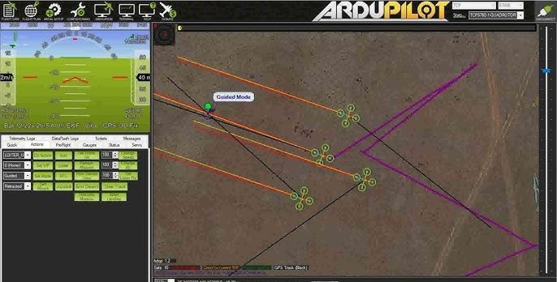
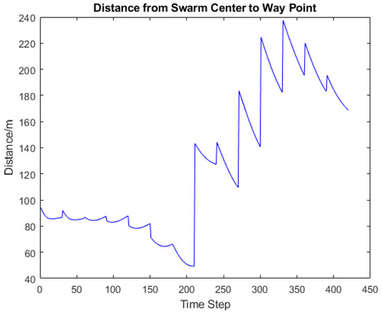

# Swayam — MAVLink Swarm Communication & Fleet Management

> **Swarm Communication System** for INS-guided, GPS-independent multi-drone coordination. Developed as part of the [ins-drone-pixhawk](https://github.com/ARYA-mgc/ins-drone-pixhawk) ecosystem by **ARYA-mgc**.

<p align="center">
  
  <br/>
  <em>Multi-rotor drones performing coordinated formation flight — real-world swarm deployment</em>
</p>

<p align="center">
  
  
  
  
  
</p>

---

## Ecosystem

**Swayam** is a module within the **ins-drone-pixhawk** ecosystem — a collection of repositories for building autonomous, GPS-denied drone systems:

| Repository | Role |
|---|---|
| [`ins-drone-pixhawk`](https://github.com/ARYA-mgc/ins-drone-pixhawk) | Core INS navigation, sensor fusion & flight control |
| **`swarm_drone_communication`** *(this repo)* | Multi-drone swarm coordination, fleet management & GCS relay |

All modules share a common MAVLink transport layer and are designed to operate together on **Pixhawk Cube Orange** + **Raspberry Pi 4** hardware.

---

## Features

| Feature | Description |
|---|---|
| **INS Navigation** | Dead-reckoning via IMU integration — body-to-world frame rotation, gravity compensation, velocity & position tracking. No GPS required. |
| **A\* Path Planning** | 8-directional A\* on a 50×50 m occupancy grid with Euclidean heuristic and obstacle inflation. |
| **MAVLink Integration** | `SET_POSITION_TARGET_LOCAL_NED` setpoints, ARM/DISARM, mode switching, `SCALED_IMU2` telemetry. Works over UDP, TCP, or serial. |
| **Fleet Coordination** | N drones in parallel threads. Broadcast missions or individual assignments. Emergency land all. |
| **SQLite Database** | 3-table schema: `flight_logs`, `ins_telemetry`, `missions`. Thread-safe with JSON export. |
| **Mission Planner GCS** | Native integration with Mission Planner — acts as a MAVLink relay, allowing GCS to discover and control the entire swarm through standard UDP/TCP ports. |
| **Hardware Platform** | Optimized for **Pixhawk Cube Orange** + **Raspberry Pi 4** (Companion Computer) via Serial/MAVLink. |
| **Advanced Relay** | High-performance MAVLink multiplexer (`swarm_gcs_relay.py`) for aggregating swarm traffic into a single GCS instance. |
| **Encryption** | AES-GCM encrypted inter-drone communication with anti-replay protection (`swarm_security.py`). |

---

## Architecture

```
swayam/
├── swayam_core.py              # Core library — 5 classes
├── swarm_gcs_relay.py          # MAVLink multiplexer / router
├── advanced_telem_bridge.py    # INS-to-MAVLink telemetry mapper
├── mission_planner_config.py   # Mission Planner connection helper
├── mavlink_bridge.py           # Robust Pi-to-Cube MAVLink bridge
├── swarm_telemetry.py          # Swarm-wide UDP telemetry broadcaster
├── pi4_swarm_node.py           # Main RPi4 node controller
├── mission_manager.py          # Multi-drone waypoint mission handler
├── system_health.py            # RPi4 + Pixhawk resource monitoring
├── swarm_security.py           # AES-GCM encryption & anti-replay
├── swarm_autonomous_logic.py   # Leader-follower & collision avoidance
├── swarm_commands.py           # Inter-drone command definitions
├── pi_hardware_config.py       # RPi 4 + Cube Orange hardware config
├── swarm_sync.py               # Multi-drone synchronization logic
├── test_swayam.py              # pytest unit tests
├── requirements.txt
└── README.md
```

### Core Classes — `swayam_core.py`

| Class | Responsibility |
|---|---|
| `INSState` | Dead-reckoning navigation (strapdown INS) |
| `GridMap` + `A*` | Occupancy grid & optimal path planning |
| `DroneAgent` | Single drone — MAVLink I/O, telemetry, missions |
| `FlightDatabase` | SQLite persistence layer |
| `SwayamFleet` | Fleet coordinator — parallel missions, logging |

---

## Quick Start

### 1. Clone & Install

```bash
git clone https://github.com/ARYA-mgc/swarm_drone_communication.git
cd swarm_drone_communication
pip install -r requirements.txt
```

### 2. Run Simulation

```bash
python scripts/run_simulation.py
```

### 3. Connect Mission Planner

1. Open **Mission Planner**.
2. Select **UDP** → click **Connect**.
3. Enter port `14550`.
4. Drones **ALPHA**, **BETA**, and **GAMMA** will appear automatically.

### 4. Run Tests

```bash
pytest tests/ -v
```

---

## Hardware Integration

### ArduPilot / Pixhawk (UDP)

```python
from src.swayam_core import SwayamFleet

fleet = SwayamFleet()
fleet.add_drone("ALPHA", system_id=1,
                connection_string="udp:192.168.1.10:14550",
                simulation=False)
fleet.connect_all()
fleet.execute_mission("ALPHA", goal_n=20.0, goal_e=15.0, altitude=10.0)
```

### STM32 + CAN-MAVLink Bridge (Serial)

```python
fleet.add_drone("BETA", system_id=2,
                connection_string="/dev/ttyUSB0,115200",
                simulation=False)
```

> **Note:** Uncomment `pymavlink>=2.4.37` in `requirements.txt` before connecting real hardware.

### SITL (Software in the Loop)

```bash
# Start ArduPilot SITL
sim_vehicle.py -v ArduCopter --out=udp:127.0.0.1:14550

# Connect Swayam
python -c "
from src.swayam_core import SwayamFleet
f = SwayamFleet()
f.add_drone('SIM', connection_string='udp:127.0.0.1:14550', simulation=False)
f.connect_all()
f.execute_mission('SIM', 10, 10, 15)
"
```

---

## Visual Documentation

### Mission Planner GCS Interface
> *`mission_planner_gcs.jpg`* — Mission Planner interface managing a fleet of drones in `GUIDED` mode with real-time telemetry overlays and waypoint tracking.



---

### Swarm Formation Flight
> *`swarm_formation_flight.jpeg`* — Two multi-rotor drones performing coordinated formation flight over an open field, demonstrating real-world swarm deployment and inter-drone spatial awareness.


---

### Fleet Distance Metrics
> *`fleet_distance_metrics.jpg`* — Plots the distance between Agent 1 and other swarm members. Critical for collision avoidance — agents maintain safe separation buffers while following independent paths.


---

### Waypoint Convergence
> *`waypoint_convergence.jpg`* — Tracks the distance from the swarm centroid to target waypoints. The periodic "sawtooth" pattern indicates rapid convergence to new targets as they are assigned.



---

## INS Navigation Detail

The `INSState` class implements a strapdown Inertial Navigation System:

| Step | Operation | Formula |
|---|---|---|
| 1 | **Attitude Update** — Gyroscope integration | `roll += ωx · dt`, `pitch += ωy · dt`, `yaw += ωz · dt` |
| 2 | **Body → World Rotation** | Full ZYX Euler rotation matrix applied to accelerometer readings |
| 3 | **Gravity Removal** | Subtract `g = 9.80665 m/s²` from world-frame Z (NED down) |
| 4 | **Velocity Integration** | `v += a_world · dt` |
| 5 | **Position Integration** | `p += v · dt` |

INS data is sourced from `SCALED_IMU2` MAVLink messages (units: milli-g, milli-rad/s).

---

## A* Path Planning

| Parameter | Value |
|---|---|
| Grid | 50 × 50 cells, 1 m/cell |
| Start | Drone's current INS position (mapped to grid) |
| Goal | Target N/E coordinates |
| Movement | 8-directional (diagonal allowed) |
| Heuristic | Euclidean distance (admissible → optimal) |
| Obstacles | Radius-based inflation |

```python
fleet.add_obstacle(x=10, y=15, radius=2)  # 5×5 blocked area
path = fleet.plan_path("ALPHA", goal_n=20, goal_e=18)
```

---

## Mission Planner Integration

The system uses `SwayamFleet` as a MAVLink relay. Each `DroneAgent` connects to a GCS (Mission Planner) and forwards telemetry.

### Advanced Multiplexing — `swarm_gcs_relay.py`

For large swarms, use `SwarmGCSRelay` to aggregate all drones into a single stream:

```python
relay = SwarmGCSRelay("udpout:127.0.0.1:14550")
relay.add_drone(1, "udpin:127.0.0.1:14551")  # Drone 1
relay.add_drone(2, "udpin:127.0.0.1:14552")  # Drone 2
relay.start()
```

### INS → MAVLink Mapping — `advanced_telem_bridge.py`

| MAVLink Message | Data Mapped |
|---|---|
| `LOCAL_POSITION_NED` | Relative coordinates from start |
| `GLOBAL_POSITION_INT` | GPS-like visualization on Mission Planner map |
| `ATTITUDE` | High-rate roll, pitch, yaw |
| `SYS_STATUS` | Battery and health monitoring |

---

## Database Schema

```sql
flight_logs     (id, drone_id, timestamp, level, event, details)
ins_telemetry   (id, drone_id, timestamp, pos_n, pos_e, pos_d,
                                           vel_n, vel_e, vel_d,
                                           roll, pitch, yaw)
missions        (id, drone_id, start_time, end_time, status,
                               path_json, notes)
```

---

## CI/CD

GitHub Actions runs on every push:

| Step | Detail |
|---|---|
| **Test Matrix** | Python 3.9, 3.10, 3.11 |
| **Coverage** | Full coverage report |
| **Simulation** | Headless swarm simulation |
| **Artifacts** | Uploads `swayam_export.json` |

---

## Contributing

1. Fork the repository
2. Create a feature branch — `git checkout -b feature/my-feature`
3. Run tests — `pytest tests/ -v`
4. Submit a pull request

---

## License

MIT — see [LICENSE](LICENSE)

---

## Roadmap

- [ ] GPS/INS fusion (Extended Kalman Filter)
- [ ] 3D voxel grid for obstacle avoidance
- [ ] WebSocket live telemetry (replace polling)
- [ ] ROS 2 bridge node
- [ ] Geofence enforcement
- [ ] Multi-vehicle conflict resolution

---

<p align="center">
  <strong>Part of the <a href="https://github.com/ARYA-mgc/ins-drone-pixhawk">ins-drone-pixhawk</a> ecosystem</strong>
  <br/>
  Built by <a href="https://github.com/ARYA-mgc"><strong>ARYA-mgc</strong></a>
</p>
